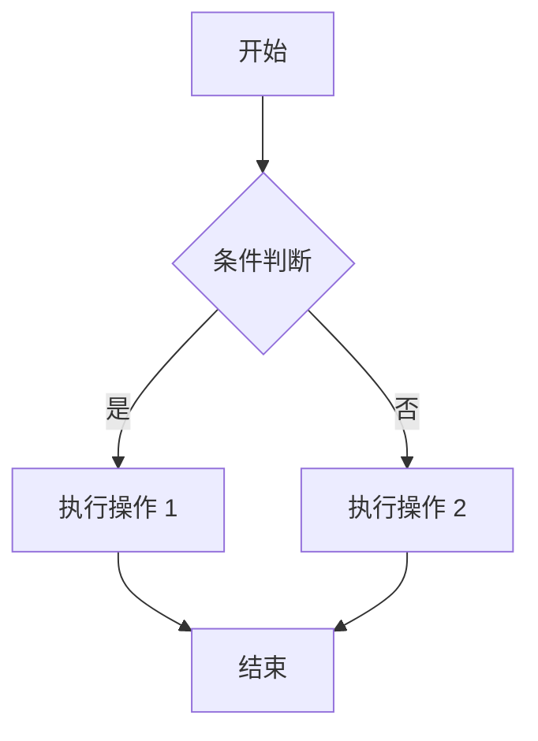
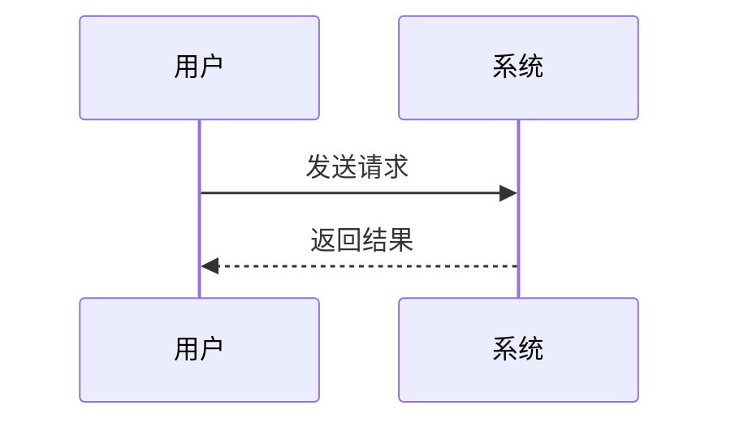

# 插件功能测试页面

## 1. 自定义容器测试

::: tip 提示
这是一个提示框测试
:::

::: info 信息
这是一个信息框测试
:::

::: warning 警告
这是一个警告框测试
:::

::: danger 危险
这是一个危险框测试
:::

::: info 注意
这是一个注意框测试
:::

## 2. 数学公式测试

行内公式：$E = mc^2$

块级公式：
$$
\frac{dx}{dt} = \sigma(y-x)
$$

另一个公式：
$$
(x+y)z = xy + yz
$$

## 3. Mermaid 图表测试



序列图测试：


## 4. 代码块测试

普通代码块：
```julia
using ModelingToolkit
@variables t x(t) y(t)
D = Differential(t)
eqs = [D(x) ~ y]
```

```python
def hello():
    print("Hello, World!")
```

## 5. 表格测试

| 参数名 | 描述 | 默认值 |
|--------|------|--------|
| `name` | 名称 | `""` |
| `age` | 年龄 | `0` |
| `active` | 是否激活 | `true` |
